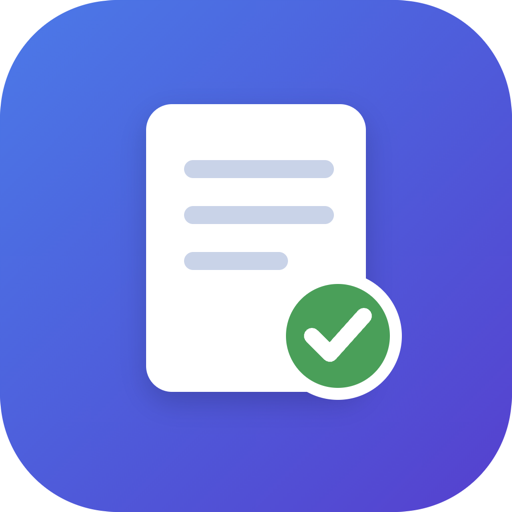
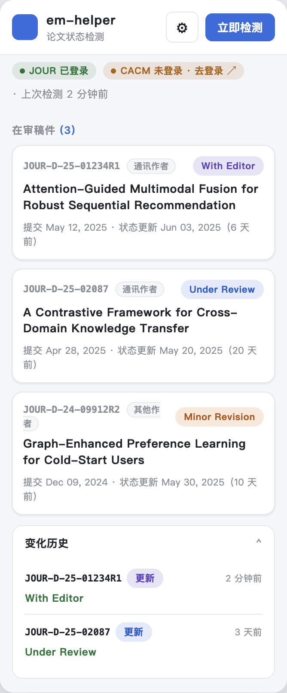

<div align="center">



# 📮 EM Status Helper

**Editorial Manager 论文状态自动检测 · Chrome / Edge 扩展**

后台定时检测你在 [Editorial Manager](https://www.editorialmanager.com) 上的稿件审稿状态，
一有变化立即弹**桌面通知**——再也不用反复手动刷新查稿。


<br/><br/>



</div>

---

## ✨ 功能特性

| | |
|---|---|
| 🔔 **状态变化通知** | 稿件状态一变（如 `With Editor` → `Under Review`）立即弹桌面通知 |
| 🕒 **后台定时检测** | 复用你已登录的会话，静默抓取，无需打开标签页；间隔可自定义 |
| 🗂 **多站点 / 多期刊** | 同时监控多个期刊，登录状态按站点分别显示 |
| 🎯 **只看在审稿件** | 自动跟进 Revisions / Submissions Being Processed，跳过已录用/退稿 |
| 🧾 **清晰卡片** | 稿号、标题、作者角色、当前状态（彩色徽章）、提交/更新日期一目了然 |
| 📜 **变化历史** | 记录每一次状态变化的时间线，最多 100 条 |
| 🔑 **掉登录一键跳转** | 检测到未登录时，点胶囊直达该期刊登录页 |
| 🌗 **深色模式** | 自动适配系统浅色 / 深色主题 |

---

## 🚀 安装

1. 下载或 `git clone` 本仓库到本地
2. 打开 `chrome://extensions`（Edge 为 `edge://extensions`）
3. 打开右上角 **开发者模式**
4. 点 **加载已解压的扩展程序**，选择本项目文件夹

---

## 📖 使用

1. 在浏览器里正常**登录** Editorial Manager
2. 点插件图标 → 齿轮 ⚙ 打开设置，填入该期刊的**任意作者页面 URL**并「添加」：
   - 最简单：登录后停在作者主页（地址通常形如
     `https://www.editorialmanager.com/<期刊代码>/default2.aspx`），点「当前页」自动抓取即可
   - 也可手动填 `.../AuthorMainMenu.aspx`——两种都行
   > 无论填哪个，插件都会自动派生并爬取该期刊的主菜单与所有在审文件夹并汇总，一个 URL 就够。
3. 设置**检测间隔**（默认 30 分钟）→ 保存；随时可点「立即检测」
4. 之后插件后台自动运行。状态变化 → 桌面通知 + 图标红色角标；未登录 → 黄色 `!` 并提示「去登录」

---

## 🔒 隐私

- **零上传**：所有数据（稿号、标题、状态、历史）只存在浏览器本地 `chrome.storage.local`，绝不发送到任何服务器
- **不碰账号密码**：仅复用你浏览器里已有的登录会话，不读取、不保存凭证

---

## ⚙️ 工作原理

- **`background.js`** — `chrome.alarms` 定时触发，`fetch(..., {credentials:'include'})` 带 Cookie 抓取；
  小范围广度爬取（起点 → `AuthorMainMenu.aspx` → `auth_*.asp` 文件夹），按稿号去重汇总；
  只跟进在审文件夹，跳过 Completed / Submissions with a Decision。
- **`offscreen.js`** — MV3 的 Service Worker 无 DOM，用 offscreen 文档的 `DOMParser` 解析 HTML；
  以稿号正则 `[A-Z]+-D-\d{2,4}-\d{3,6}(R\d+)?` 定位表格行，提取标题、状态、日期、作者角色。
- **变化检测** — 对比上次快照，任意稿件行文本变化即通知；首次运行只建立基线不打扰。
- **登录判定** — 以「页面含 Logout 链接 / 抓到稿件」为正向信号（而非仅靠有无密码框）。

---

## 📝 说明与限制

- 会话过期后插件会提示，重新登录即可继续。
- 若某期刊页面需表单 POST 才能到达（直接 GET 只返回登录页），请改用登录后能直接打开的列表页 URL。
- 若已登录却「检测到 0 篇」，通常是稿号格式不同——可提 issue 附上稿号样式，方便调整正则。
- 检测间隔最小 1 分钟；为减轻服务器压力，建议 **30~60 分钟**。

---

## 📁 项目结构

```
├── manifest.json      # MV3 配置
├── background.js      # 定时抓取 + 爬取 + 变化对比 + 通知
├── offscreen.js/html  # DOMParser 解析（SW 无 DOM）
├── popup.html/css/js  # 弹窗界面：稿件卡片 / 历史 / 设置
└── icons/             # 扩展图标
```

---

<div align="center">
<sub>仅供个人查稿使用 · 请合理设置检测间隔，避免给期刊服务器造成压力</sub>
</div>
